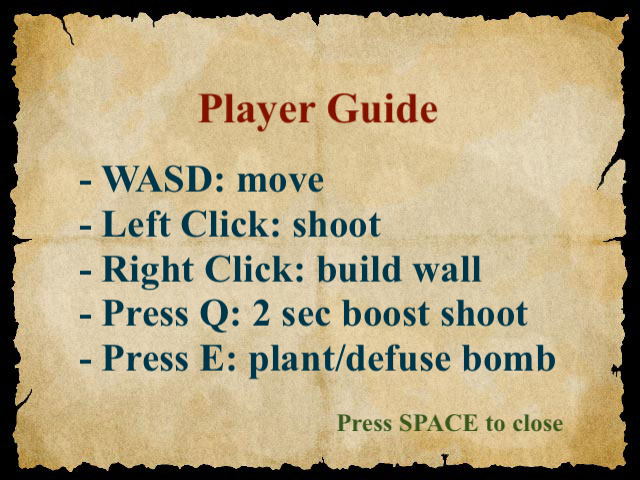
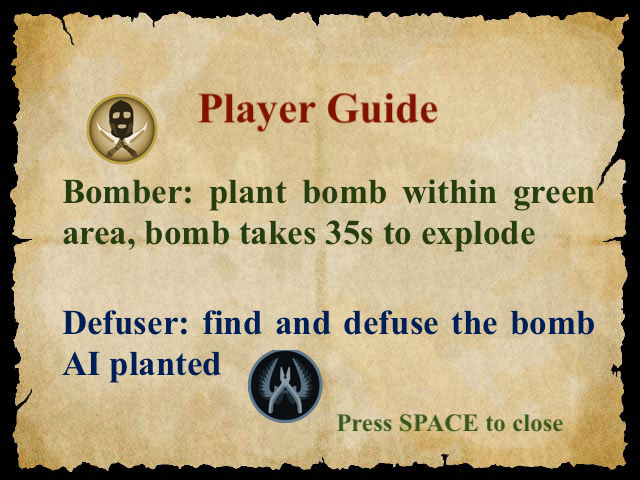
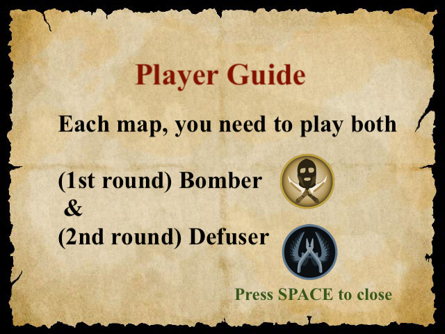
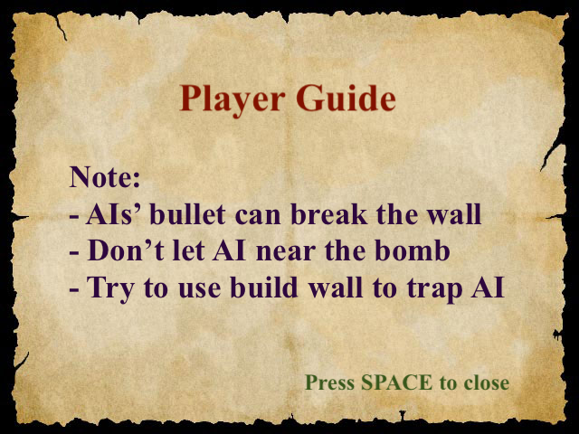

### Team Members:
- Andrew Chang (18954164)
- Ivy He (72574213)
- John Jiang (90965252)
- Chris Li (53908398)
- Kevin Liang (19025162)
- William Wu (98621378)

---

### Stroy

The president of the country has escaped, so the government is under no one's control. Two
groups of people are fighting against each other to control the country: the Bomber and the
Defuser, which players can choose to join one of the teams. The Bomber will carry a bomb in the
beginning and has a time limit to plant the bomb, and the Defuser can either slain the Bomber or
defuse the planted bomb to claim victory. The map will be surrounded by fog so that the players
will have restricted visions, and they can find tools (such as light) to reveal the fog within a
certain range. Both the Bomber and the Defuser can build walls to protect themselves from
getting shot and perform strategic planning.

The bomb will be planted by the Bomber in certain places and need to be defused by the Defuser
within a certain time. The round will end if the bomb explodes, the bomb is defused, one of the
players is slain by another, or the time limit reaches zero. If the bomb explodes, the Bomber will
win. If the Defuser successfully defuses the bomb or Bomber exceeds the time limit to plant a
bomb, the Defuser wins.

---
### Player Guide

---

### Features
- AI:
  - Random/Coded Action
  - State Machine
  - Behaviour Tree
  - Simple Path Finding (BFS)
  - Swarm Behaviour
  - Advanced Decision Making (A*)
  - Cooperative Planning
- Animation
  - KeyFrame Animation
  - Sprite Animation
- Rendering
  - Textured Geometry
  - Adaptive Resolution
  - Debugging graphics
  - Parallax Scrolling Background
  - Advanced Fragment Shader
  - Advanced Geometry Shader
  - Light
  - Particle Systems
- Software Engnieer
  - Observer Pattern
  - Level Loading
  - External Integration
- User Experience
  - Help
  - Tutorial
  - Story
  - Game Balance
- UI and IO
  - Keyboard, Mouse control
  - Camera Control
  - Mouse Gesture
  - Audio Feedback
- Physics & Simulation
  - Basic Collision Detection
  - Collision Resolution
  - Precious Collision
  - Non-convex Collision